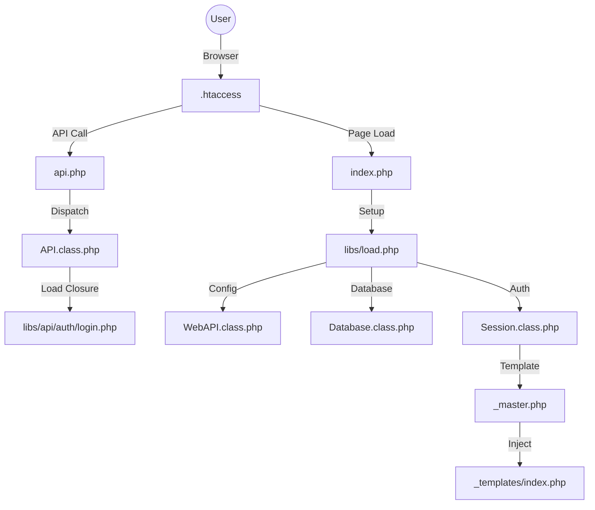

# 🌌 Aether Catalyst: PHP Framework Generator

[](https://www.php.net/)
[](LICENSE)
[](https://github.com/sakilobm/Aether-Catalyst)

**Aether Catalyst** is a powerful automation suite designed to reverse-engineer and scaffold high-performance, dark-themed PHP applications. It transforms a "Golden Standard" framework architecture into a repeatable, CLI-driven project factory.

---

## ✨ Premium Features

*   **🌑 Signature Dark Aesthetics:** Built-in design system featuring `--background: #030407` and a sleek, modern UI.
*   **🖱️ Dynamic GSAP Cursor:** Interactive "Ball" cursor that reacts to hoverable elements with smooth lag and expansion.
*   **🔔 Toast v3 System:** A robust, animated notification engine (`toast.success()`, `toast.error()`).
*   **🛡️ 4-Level Security:** Token-based session validation checking IP, User-Agent, Fingerprint, and expiration.
*   **🚀 Closure-Based API:** Flexible routing system where endpoints are defined as scoped closures.
*   **💎 Magic ORM Trait:** `SQLGetterSetter` provides dynamic getters/setters and atomic increments/decrements.
*   **🤖 AI-Ready Prompting:** Automatically generates a comprehensive `AI_PROMPT.md` for every new project to train LLMs on your specific codebase.

---

## 🏗️ Framework Architecture



---

## 🛠️ Getting Started

### Prerequisites

*   **PHP 8.1+** (CLI enabled)
*   **MySQL 8.0+**
*   **Apache** (with `mod_rewrite` enabled)
*   **Composer**

### Installation

1.  Clone the repository:
    ```bash
    git clone https://github.com/sakilobm/Aether-Catalyst.git
    cd Aether-Catalyst
    ```

2.  Ensure the `skeleton/` directory is present (contains the core framework files).

---

## 🏗️ Generating a New Project

The `forge.php` script is your primary tool for scaffolding. It handles directory creation, configuration, and database initialization.

```bash
php forge.php
```

### What happens during Forge?

1.  **Identity:** Define your project title (e.g., "Nebula CMS").
2.  **Database:** Input your MySQL credentials. Forge creates the DB and runs `base.sql`.
3.  **Paths:** Set your `base_path` (e.g., `/nebula/htdocs/`).
4.  **Scaffolding:** Copies the clean skeleton into `projects/{slug}/`.
5.  **Intelligence:** Generates `AI_PROMPT.md` inside your new project folder.

---

## 🧠 AI-Driven Development Workflow

Every generated project includes an `AI_PROMPT.md`. This file is designed to be pasted into **ChatGPT (o1/o3)**, **Claude 3.7+**, or **Antigravity**.

It provides the AI with:
-   Full class signatures and available methods.
-   The exact closure-based API pattern.
-   Template injection rules.
-   Security standards for the project.

**Use this prompt to build features in seconds:** 
> "Generate a 'Product' model and an admin interface to manage inventory based on the framework rules in this prompt."

---

## 📂 Project Structure

```text
/
├── forge.php                # CLI Project Generator
├── skeleton/                # The "Golden" Template
│   ├── htdocs/              # Web Root (index, api, admin, assets)
│   ├── project/             # Configuration (config.json)
│   └── docs/                # Framework Documentation
└── projects/                # Your generated applications
```

---

## 📜 Core Coding Rules

1.  **Bootstrap First:** All PHP files must start with `require_once 'libs/load.php';`.
2.  **No Hardcoding:** Use `get_config('key')` for all credentials and paths.
3.  **Sanitize Always:** The `REST` base class handles input cleaning; use `$this->_request`.
4.  **Secure Writes:** Call `$this->isAuthenticated()` in all write-level API endpoints.
5.  **Template Engine:** Use `Session::loadTemplate('folder/file', $data)` for all UI components.

---

> [!TIP]
> Always run `composer install` inside the `htdocs` directory of your generated project to pull in dependencies like Carbon and RabbitMQ.

> [!IMPORTANT]
> The `config.json` file is automatically added to `.gitignore`. Never commit your production credentials!

---

Developed by **Antigravity** for **sakilobm**
